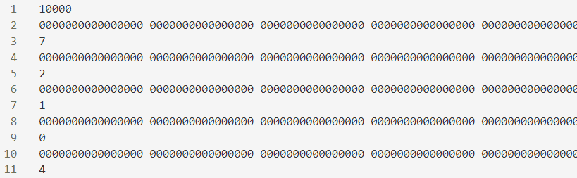
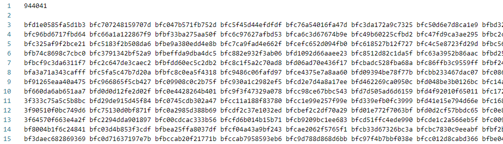

# SFP Converter For DNN Accelerator
可將訓練好的DNN模型由浮點數轉為加速器內部運算的定點數格式-SFP（Static Floating Point）
* 以訓練資料評估神經元輸出的正規化因子，並以神經元為單位做正規化
* 可自行選擇定點數的最小精度（2^(−1)  ~ 2^(−15)）

使用者需提供訓練好的DNN模型（hdf5或onnx）、訓練資料與測試資料（格式如下），轉換完成後程式會自動驗證資料轉換成定點數後的效果如何

轉換後的DNN參數會存成DNN加速器的testbench可直接讀取的資料格式，也會提供定點數DNN對應的輸入與輸出資料，讓使用者能自行驗證

## 資料格式
分類型 - 第一行的整數代表檔案中共有幾筆資料，再來每筆資料有兩行，一行為DNN的輸入資料，以倍精度且16進制的格式表示，另一行為分類答案


回歸型 - 除了第一行依然為代表資料總筆數的整數外，之後的每一行皆表示一筆資料，同樣以倍精度且16進制的格式表示


## 模型轉換-hdf5或onnx到model.txt
程式位於tool/FormatConverter下
```
python [forHDF5.py|forONNX.py] path_to_model
```

## 定點數轉換
程式位於tool/SFPConverter下

需提供以下參數
* -p：指定的定點數最小精度
* -m：訓練完的 DNN 模型位置
* -td：訓練資料檔案位置
* -vd：測試資料檔案位置

範例
* 15代表定點數所能表示的最小精度為2^(−15)
```
./SFP –p 15 -m “model.txt” -td “train_data.txt” -vd “test_data.txt”
```

## 在 DNN 硬體加速器上執行轉換後的 DNN 模型
1. 先將DNN模型由hdf5或onnx轉成本工具可接受的檔案model.txt
2. 執行定點數轉換
3. 在轉換後將SFPConverter底下的資料夾model內的檔案全部移至原IP的資料夾data底下
4. 以本工具提供的dnn_tb.v取代原IP的dnn_tb.v
5. 修改原IP底下的資料夾mem_behav內的檔案bus_behav.v中，分別用來指定DNN參數位置和DNN輸入位置的參數param_file_name與input_file_name
